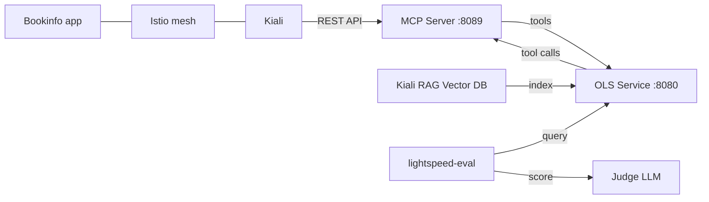

# Kiali — LightSpeed Troubleshooting Evaluation

> Latest evaluation results: **[RESULTS.md](RESULTS.md)**  
> Full setup & run guide: **[DEVELOPMENT.md](DEVELOPMENT.md)**

End-to-end evaluation of the [OpenShift LightSpeed](https://github.com/openshift/lightspeed-service)
troubleshooting agent against a live Kiali / Istio cluster.

Conversations are defined in `scenarios/conversations.yaml`. Each one deploys a broken
workload via a setup script, asks the agent to diagnose and fix it, then cleans up.
Responses are scored with LLM-based metrics (`custom:answer_correctness`,
`custom:keywords_eval`, `custom:tool_eval`).

---

## Architecture



| Component | Role |
|---|---|
| **Kubernetes MCP Server** | Exposes Kiali observability tools via MCP protocol so OLS can query the mesh |
| **Kiali RAG Vector DB** | Provides grounded Kiali/Istio documentation as embeddings for OLS responses |
| **OpenShift Lightspeed (OLS)** | The AI troubleshooting agent under evaluation |
| **lightspeed-evaluation** | Sends scenario queries to OLS and scores responses with the judge LLM |
| **Judge LLM** | Independent model (Claude Opus / Gemini) that scores agent correctness |

---

## LLM Configuration

Two LLM providers are supported. Switch with `PROVIDER=openai` (default) or `PROVIDER=google`.

| Provider | OLS backend | Judge LLM | Credentials |
|---|---|---|---|
| `openai` (default) | Gemini via OpenAI-compat endpoint | Claude Opus via Vertex AI | `~/.openai/openai_api_key.txt` + `~/.gcp/gcp_credentials.txt` |
| `google` | Gemini via Google Vertex AI | Gemini via Vertex AI | `~/.gcp/gcp_credentials.txt` |

See [DEVELOPMENT.md](DEVELOPMENT.md) for the full credential setup guide.

---

## Quick start

```bash
# 1. Set up credentials (see DEVELOPMENT.md §2)

# 2. Install the evaluation framework
make setup && make setup-vector-db

# 3. Terminal 1 — MCP server
make run-mcp

# 4. Terminal 2 — OLS service
make run-ols               # openai (default)
make run-ols PROVIDER=google

# 5. Terminal 3 — Run evaluations
make all
make all PROVIDER=google

# 6. Generate report
make generate-results
```

---

## Makefile reference

### Setup

| Target | Description |
|--------|-------------|
| `make setup` | Create `venv/` and install the evaluation framework |
| `make setup-vector-db` | Extract the Kiali RAG index from the BYOK image |
| `make setup-dashboard` | Clone and install the web dashboard |
| `make check-provider` | Show active provider, OLS config, and system config |

### Services

| Target | Description |
|--------|-------------|
| `make run-ols [PROVIDER=…]` | Run the LightSpeed service container (port 8080) |
| `make run-mcp` | Start the Kubernetes MCP server with Kiali toolset (port 8089) |
| `make run-dashboard` | Start the evaluation dashboard (port 5173) |

### Evaluation

| Target | Description |
|--------|-------------|
| `make all [PROVIDER=…]` | Run all conversations |
| `make fix_bookinfo_fault_injection` | Run one conversation |
| `make fix_bookinfo_routing` | Run one conversation |
| `make check_mesh_status` | Run one conversation |
| `make troubleshoot_latency_trace` | Run one conversation |
| `make generate-results [PROVIDER=…]` | Generate `RESULTS.md` |
| `make clean-results [PROVIDER=…]` | Wipe `results/<provider>/` |

### Overridable variables

| Variable | Default | Description |
|---|---|---|
| `PROVIDER` | `openai` | LLM provider (`openai` or `google`) |
| `KIALI_ENDPOINT` | `https://kiali-istio-system.apps-crc.testing/` | Kiali UI/API URL |
| `OLS_IMAGE` | `quay.io/openshift-lightspeed/lightspeed-service-api:latest` | OLS image |
| `WAIT_SECONDS` | `200` | Seconds to wait after setup/cleanup for metrics |
| `KIALI_RAG_DB` | `quay.io/kiali/kiali-byok:latest` | BYOK image for vector DB |

---

## Project layout

```
.
├── Makefile                          # Setup and service targets
├── DEVELOPMENT.md                    # Step-by-step setup and run guide
├── scenarios/
│   ├── scenarios.mk                  # Evaluation targets (included by Makefile)
│   ├── conversations.yaml            # All evaluation conversations
│   ├── fix_bookinfo_fault_injection/ # Fault injection scenario
│   ├── fix_bookinfo_routing/         # Traffic routing scenario
│   ├── troubleshoot_latency_trace/   # Latency / trace scenario
│   └── check_mesh_status/            # (no setup/cleanup needed)
├── system/
│   ├── system_openai.yaml            # Judge + API config for openai provider
│   └── system_google.yaml            # Judge + API config for google provider
├── olsconfig/
│   ├── olsconfig-openai.yaml         # OLS config for openai provider
│   └── olsconfig-google.yaml         # OLS config for google provider
├── mcp_config.toml                   # Kubernetes MCP server config
├── scripts/
│   └── generate_results.py           # RESULTS.md generator
├── vector_db/                        # git-ignored — from make setup-vector-db
├── dashboard/                        # git-ignored — from make setup-dashboard
└── results/                          # evaluation output
    ├── <conv>_<model>.md             # committed per-run detail pages
    └── evaluation_*.csv / *.json     # git-ignored raw data
```

---

## Conversations

All conversations are defined in `scenarios/conversations.yaml` with optional
`setup_script` / `cleanup_script` (resolved relative to the YAML file).

| Conversation | Category | Description |
|---|---|---|
| `check_mesh_status` | Health | Agent reports mesh and service health |
| `fix_bookinfo_fault_injection` | Fault injection | 100% HTTP 503 on ratings — diagnose and fix |
| `fix_bookinfo_routing` | Traffic routing | reviews-v3 weight 0 — find and fix |
| `troubleshoot_latency_trace` | Latency / tracing | 3-second delay on ratings — trace and fix |
