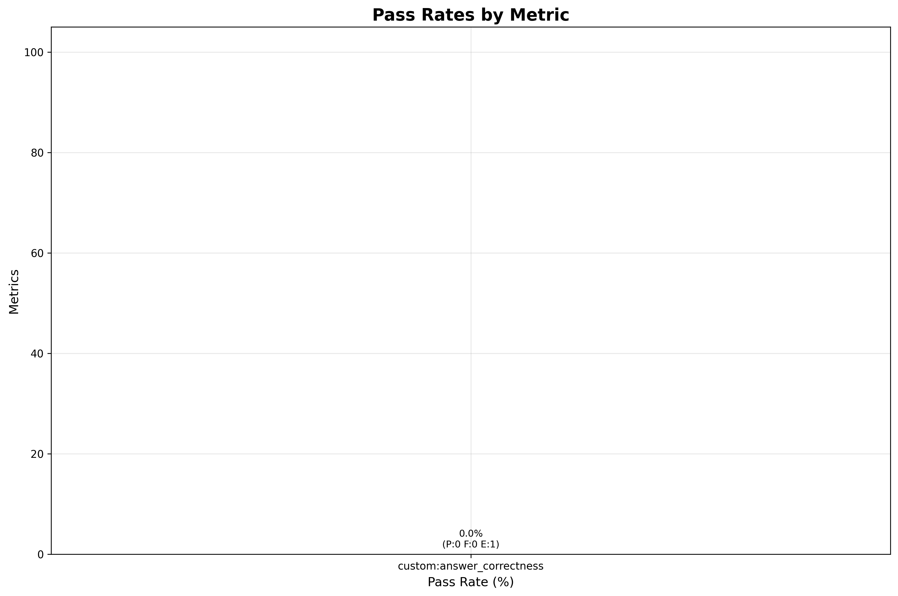
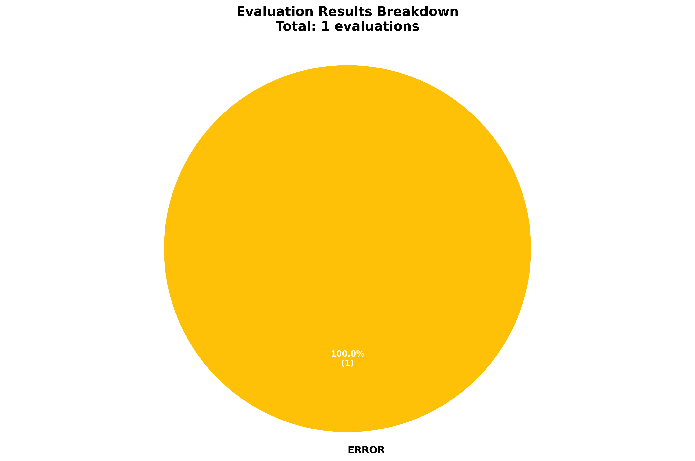

# ❌ check_mesh_status_no_kiali

**OLS model:** `openai/gpt-5` &nbsp;|&nbsp; **Judge:** `openai/gpt-5.4-mini`  
**Run:** 2026-06-10 17:35:13 &nbsp;|&nbsp; **Evaluations:** 1 &nbsp;|&nbsp; ✅ 0 PASS &nbsp; ❌ 0 FAIL &nbsp; ⚠️ 1 ERROR &nbsp; (0%)

> Check the status of the mesh and identify any issues.

---

## Pass Rates

More graphs

### Status Breakdown

## Metrics

| Metric | ✅ | ❌ | ⚠️ | Pass Rate | Mean Score |
|---|---|---|---|---|---|
| `custom:answer_correctness` | 0 | 0 | 1 | ❌ 0% | 0.00 |

## Turns

### Turn: `diagnose`

**Metrics:** `custom:answer_correctness`

**Query:** Check the status of the mesh and identify any issues.

| Metric | Result | Score |
|---|---|---|
| `custom:answer_correctness` | ⚠️ ERROR | — |

Judge reasons (failures)

**`custom:answer_correctness`:** API Error for turn diagnose: API error: 400 - {"detail":"Bad request: No auth header found"}

Expected response

Without Kiali tools, the agent should still provide a structured Istio mesh health assessment grounded in cluster-native evidence (oc/kubectl, istioctl, certificate or proxy status output), typically organized as:
Assessment summary — report overall mesh status from available evidence, such as workload SPIFFE identities and certificate availability (leaf and root certs, NotBefore/NotAfter, Available=true/false), and note whether identities appear consistent across workloads and namespaces.
Issues found — when problems exist, list numbered findings with severity, concrete evidence from the tool output (e.g. missing leaf certificate for a workload, inconsistent spiffe:// identity format or trust domain, expired or soon-to-expire certs), and the likely impact on mTLS or mesh connectivity.
Next steps to fix/verify — provide actionable remediation or validation steps using oc/kubectl and istioctl commands, such as checking sidecar injection, proxy SDS secrets, ServiceAccount/annotations, restarting affected workloads, verifying SMCP/SMMR trust domain configuration, and inspecting proxy certificate rotation. When the mesh appears healthy, confirm certificates and identities are present and valid for the inspected workloads.

---

*Tokens — Judge: 0 | API: 0 | Total: 0*
*Latency — mean: 0.0s | p95: 0.0s*