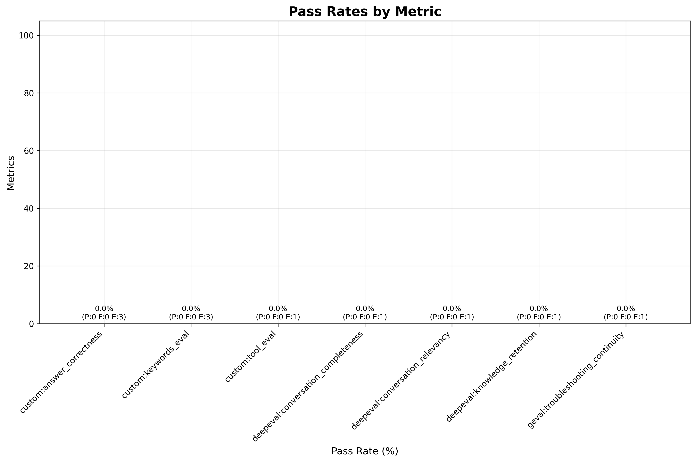
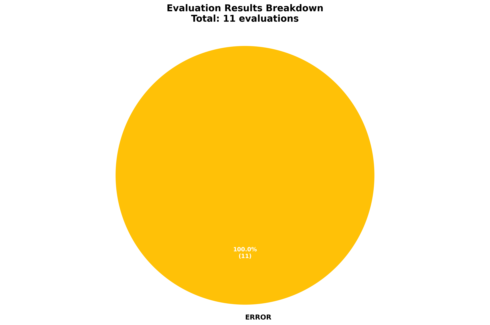

# ❌ fix_bookinfo_fault_injection

**OLS model:** `openai/gpt-5` &nbsp;|&nbsp; **Judge:** `openai/gpt-5.4-mini`  
**Run:** 2026-06-11 11:34:45 &nbsp;|&nbsp; **Evaluations:** 11 &nbsp;|&nbsp; ✅ 0 PASS &nbsp; ❌ 0 FAIL &nbsp; ⚠️ 11 ERROR &nbsp; (0%)

> Multi-turn: a 100% fault injection on ratings causes 503 errors. Agent investigates, identifies root cause, and fixes it.

---

## Pass Rates

More graphs

### Status Breakdown

## Metrics

| Metric | ✅ | ❌ | ⚠️ | Pass Rate | Mean Score |
|---|---|---|---|---|---|
| `custom:answer_correctness` | 0 | 0 | 3 | ❌ 0% | 0.00 |
| `custom:keywords_eval` | 0 | 0 | 3 | ❌ 0% | 0.00 |
| `custom:tool_eval` | 0 | 0 | 1 | ❌ 0% | 0.00 |
| `deepeval:conversation_completeness` | 0 | 0 | 1 | ❌ 0% | 0.00 |
| `deepeval:conversation_relevancy` | 0 | 0 | 1 | ❌ 0% | 0.00 |
| `deepeval:knowledge_retention` | 0 | 0 | 1 | ❌ 0% | 0.00 |
| `geval:troubleshooting_continuity` | 0 | 0 | 1 | ❌ 0% | 0.00 |

## Turns

### Turn: `investigate`

**Metrics:** `custom:answer_correctness` · `custom:keywords_eval` · `custom:tool_eval`

**Query:** Some users are seeing errors on the Bookinfo product page — it looks like the ratings service is broken. All pods are running and mTLS / auth policies are not the issue. All Istio resources are in the 'bookinfo' namespace. Can you check the Istio VirtualService routing rules for the ratings service and find what's causing the problem?

| Metric | Result | Score |
|---|---|---|
| `custom:answer_correctness` | ⚠️ ERROR | — |
| `custom:keywords_eval` | ⚠️ ERROR | — |
| `custom:tool_eval` | ⚠️ ERROR | — |

Judge reasons (failures)

**`custom:answer_correctness`:** API Error for turn investigate: API error: 500 - {"detail":{"response":"[LLM Backend] An error occurred during LLM invocation. Please contact your OpenShift Lightspeed administrator.","cause":"An error occurred while processing your request. You can retry your request, or contact us through our help center at help.openai.com if the error persists. 

**`custom:keywords_eval`:** API Error for turn investigate: API error: 500 - {"detail":{"response":"[LLM Backend] An error occurred during LLM invocation. Please contact your OpenShift Lightspeed administrator.","cause":"An error occurred while processing your request. You can retry your request, or contact us through our help center at help.openai.com if the error persists. 

**`custom:tool_eval`:** API Error for turn investigate: API error: 500 - {"detail":{"response":"[LLM Backend] An error occurred during LLM invocation. Please contact your OpenShift Lightspeed administrator.","cause":"An error occurred while processing your request. You can retry your request, or contact us through our help center at help.openai.com if the error persists. 

Expected signals

**Keywords:**  
Option 1: `bookinfo` + `ratings` + `error`  
Option 2: `bookinfo` + `ratings` + `503`

**Tool calls:**

*Alt 1:*
  - `kiali_get_mesh_traffic_graph`(namespaces=bookinfo)

*Alt 2:*
  - `kiali_get_logs`(namespace=bookinfo)

*Alt 3:*
  - `kiali_get_mesh_status`()

*Alt 4:*
  - `kiali_manage_istio_config_read`(namespace=bookinfo, action=list, serviceName=ratings)
  - `kiali_manage_istio_config_read`(namespace=bookinfo, action=get, kind=VirtualService, object=ratings, group=networking.istio.io, version=v1)

*Alt 5:*
  - `kiali_manage_istio_config_read`(namespace=bookinfo, action=list, kind=VirtualService)

*Alt 6:*
  - `kiali_manage_istio_config_read`(namespace=bookinfo, action=list)
  - `kiali_manage_istio_config_read`(namespace=bookinfo, action=get, kind=VirtualService, object=ratings, group=networking.istio.io, version=v1)

Expected response

The agent should investigate the Bookinfo application and report that the ratings service is returning errors (HTTP 503). It should identify symptoms such as failed requests from the reviews service to ratings, error rates visible in the traffic graph, or error messages in pod logs.

### Turn: `root_cause`

**Metrics:** `custom:answer_correctness` · `custom:keywords_eval`

**Query:** Can you identify the specific root cause?

| Metric | Result | Score |
|---|---|---|
| `custom:answer_correctness` | ⚠️ ERROR | — |
| `custom:keywords_eval` | ⚠️ ERROR | — |

Judge reasons (failures)

**`custom:answer_correctness`:** Cascade failure from turn 1 API error: API Error for turn investigate: API error: 500 - {"detail":{"response":"[LLM Backend] An error occurred during LLM invocation. Please contact your OpenShift Lightspeed administrator.","cause":"An error occurred while processing your request. You can retry your request, or contact us through our help center at 

**`custom:keywords_eval`:** Cascade failure from turn 1 API error: API Error for turn investigate: API error: 500 - {"detail":{"response":"[LLM Backend] An error occurred during LLM invocation. Please contact your OpenShift Lightspeed administrator.","cause":"An error occurred while processing your request. You can retry your request, or contact us through our help center at 

Expected signals

**Keywords:**  
Option 1: `fault injection` + `ratings` + `VirtualService`  
Option 2: `503` + `ratings` + `VirtualService`

**Tool calls:**

*Alt 1:*
  - `kiali_manage_istio_config_read`(namespace=bookinfo, action=get, kind=VirtualService, object=ratings, group=networking.istio.io, version=v1)

*Alt 2:*
  - `kiali_manage_istio_config_read`(namespace=bookinfo, action=list)
  - `kiali_manage_istio_config_read`(namespace=bookinfo, action=get, kind=VirtualService, object=ratings, group=networking.istio.io, version=v1)

Expected response

The root cause is a fault injection rule in the ratings VirtualService that aborts 100% of requests with HTTP 503. The ratings VirtualService in the bookinfo namespace contains a fault.abort block configured with httpStatus 503 and percentage value 100. The agent may explore other potential causes before arriving at this conclusion. What matters is that the final diagnosis correctly identifies the fault.abort configuration in the ratings VirtualService.

### Turn: `fix`

**Metrics:** `custom:answer_correctness` · `custom:keywords_eval`

**Query:** Please fix it.

| Metric | Result | Score |
|---|---|---|
| `custom:answer_correctness` | ⚠️ ERROR | — |
| `custom:keywords_eval` | ⚠️ ERROR | — |

Judge reasons (failures)

**`custom:answer_correctness`:** Cascade failure from turn 1 API error: API Error for turn investigate: API error: 500 - {"detail":{"response":"[LLM Backend] An error occurred during LLM invocation. Please contact your OpenShift Lightspeed administrator.","cause":"An error occurred while processing your request. You can retry your request, or contact us through our help center at 

**`custom:keywords_eval`:** Cascade failure from turn 1 API error: API Error for turn investigate: API error: 500 - {"detail":{"response":"[LLM Backend] An error occurred during LLM invocation. Please contact your OpenShift Lightspeed administrator.","cause":"An error occurred while processing your request. You can retry your request, or contact us through our help center at 

Expected signals

**Keywords:**  
Option 1: `removed` + `ratings`  
Option 2: `VirtualService` + `ratings`  
Option 3: `fixed` + `ratings`

**Tool calls:**

*Alt 1:*
  - `kiali_manage_istio_config`(namespace=bookinfo, action=patch, kind=VirtualService, object=ratings, group=networking.istio.io, version=v1, data=.*)

*Alt 2:*
  - `kiali_manage_istio_config`(namespace=bookinfo, action=delete, kind=VirtualService, object=ratings, group=networking.istio.io, version=v1)

Expected response

The agent should remove the fault injection rule from the ratings VirtualService, either by patching it to remove the fault.abort block or by deleting the VirtualService if it was created solely for the fault injection.

### Turn: ``

| Metric | Result | Score |
|---|---|---|
| `geval:troubleshooting_continuity` | ⚠️ ERROR | — |
| `deepeval:conversation_relevancy` | ⚠️ ERROR | — |
| `deepeval:knowledge_retention` | ⚠️ ERROR | — |
| `deepeval:conversation_completeness` | ⚠️ ERROR | — |

Judge reasons (failures)

**`geval:troubleshooting_continuity`:** Cascade failure from turn 1 API error: API Error for turn investigate: API error: 500 - {"detail":{"response":"[LLM Backend] An error occurred during LLM invocation. Please contact your OpenShift Lightspeed administrator.","cause":"An error occurred while processing your request. You can retry your request, or contact us through our help center at 

**`deepeval:conversation_relevancy`:** Cascade failure from turn 1 API error: API Error for turn investigate: API error: 500 - {"detail":{"response":"[LLM Backend] An error occurred during LLM invocation. Please contact your OpenShift Lightspeed administrator.","cause":"An error occurred while processing your request. You can retry your request, or contact us through our help center at 

**`deepeval:knowledge_retention`:** Cascade failure from turn 1 API error: API Error for turn investigate: API error: 500 - {"detail":{"response":"[LLM Backend] An error occurred during LLM invocation. Please contact your OpenShift Lightspeed administrator.","cause":"An error occurred while processing your request. You can retry your request, or contact us through our help center at 

**`deepeval:conversation_completeness`:** Cascade failure from turn 1 API error: API Error for turn investigate: API error: 500 - {"detail":{"response":"[LLM Backend] An error occurred during LLM invocation. Please contact your OpenShift Lightspeed administrator.","cause":"An error occurred while processing your request. You can retry your request, or contact us through our help center at 

---

*Tokens — Judge: 0 | API: 0 | Total: 0*
*Latency — mean: 181.4s | p95: 181.4s*